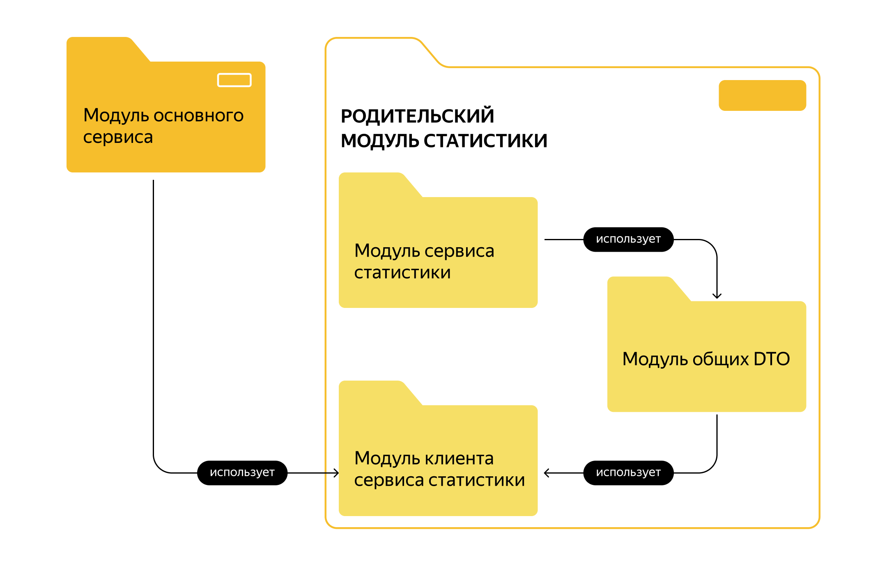
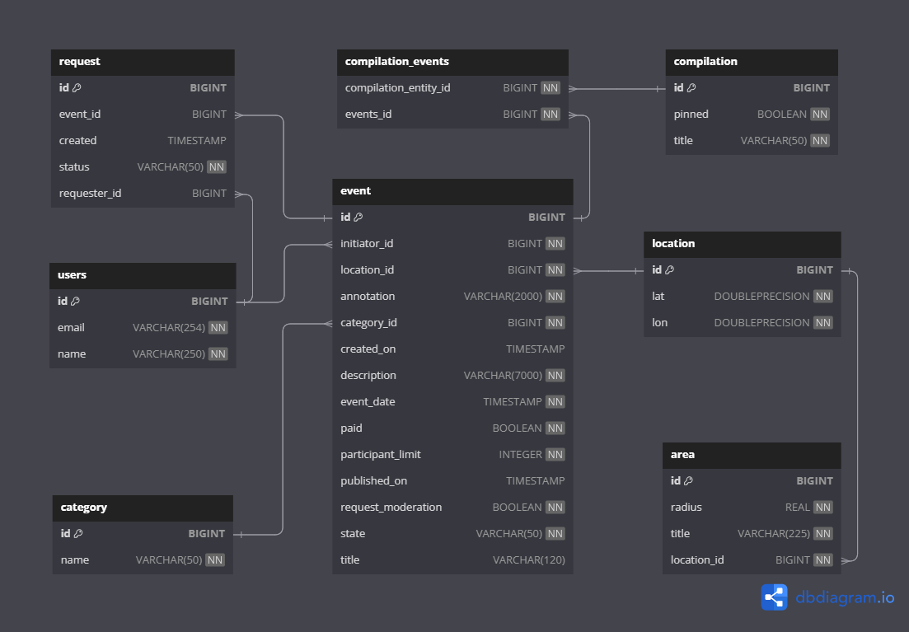

# **Explore With Me**

Backend для приложения **ExploreWithMe** (англ. «Исследуй Со Мной») дает возможность делиться информацией об интересных событиях и помогает найти компанию для участия в них.

Приложение, которое создает афишу. В этой афише можно предложить какое-либо событие от выставки до похода в кино и собрать компанию для участия в нём.

---

### Стек:
Java 11, Spring Boot, PostgreSQL, JPA Hibernate, Lombok, Maven, Docker.

---

### Микросервисы
1) _**Основной сервис**_ — REST API сервис, содержит всё необходимое для работы продукта.

    **API** разделено на три части:
    1) 

 Публичная, доступна без регистрации любому пользователю сети.

        
        Публичный API предоставляет возможности поиска и фильтрации событий. Учтены следующие моменты:
      
        - сортировка списка событий организована по количеству просмотров, которое будет запрашиваться в сервисе статистики, либо по датам событий;
        - при просмотре списка событий возвращается только краткая информация о мероприятиях;
        - просмотр подробной информации о конкретном событии настроен отдельно (через отдельный эндпоинт);
        - каждое событие относится к какой-то из закреплённых в приложении категорий;
        - настроена возможность получения всех имеющихся категорий и подборок событий (такие подборки будут составлять администраторы ресурса);
        - каждый публичный запрос для получения списка событий или полной информации о мероприятии фиксируется сервисом статистики.
         

    2) 

Закрытая, доступна только авторизованным пользователям.

      
        Закрытая часть API реализует возможности зарегистрированных пользователей продукта. Вот что учтено:
      
        - авторизованные пользователи имеют возможность добавлять в приложение новые мероприятия, редактировать их и просматривать после добавления;
        - настроена подача заявок на участие в интересующих мероприятиях;
        - создатель мероприятия имеет возможность подтверждать заявки, которые отправили другие пользователи сервиса.
        

    3) 

Административная, для администраторов сервиса.

      
        Административная часть API предоставляет возможности настройки и поддержки работы сервиса. Обратите внимание на эти пункты:
      
        - настроено добавление, изменение и удаление категорий для событий;
        - есть возможность добавлять, удалять и закреплять на главной странице подборки мероприятий;
        - налажена модерация событий, размещённых пользователями, — публикация или отклонение;
        - также настроено управление пользователями — добавление, активация, просмотр и удаление.
        

  
2. _**Сервис статистики**_ — собирает информацию:
    1) О количестве обращений пользователей к спискам событий 
    2) О количестве запросов к подробной информации о событии. 
   
    На основе этой информации должна формироваться статистика о работе приложения.
    

Содержание функционала сервиса статистики

    - запись информации о том, что был обработан запрос к эндпоинту API;
    - предоставление статистики за выбранные даты по выбранному эндпоинту.

    Чтобы можно было использовать сервис статистики, разработан HTTP-клиент. Он будет отправлять запросы и обрабатывать ответы.

    
  

 ➡️ Аутентификация и авторизация

Оба сервиса ExploreWithMe работают внутри VPN. 
С внешним миром сервисы связывает сетевой шлюз. 
Он контактирует с системой аутентификации и авторизации, а затем перенаправляет запрос в сервисы. 
То есть, если шлюз пропустил запрос к закрытой или административной части API, значит, этот запрос успешно прошел аутентификацию и авторизацию.

---

### Спецификация API
1. [Основной сервис (swagger)](https://petstore.swagger.io/?url=https://raw.githubusercontent.com/elgordogato/explore-with-me/main/ewm-main-service-spec.json)
2. [Сервис статистики (swagger)](https://petstore.swagger.io/?url=https://raw.githubusercontent.com/elgordogato/explore-with-me/main/ewm-stats-service-spec.json)

---

### Модель данных

Жизненный цикл события включает несколько этапов:
1) Создание.
2) Ожидание публикации. В статус ожидания публикации событие переходит сразу после создания.
3) Публикация. В это состояние событие переводит администратор.
4) Отмена публикации. В это состояние событие переходит в двух случаях. 
   - если администратор решил, что его нельзя публиковать. 
   - когда инициатор события решил отменить его на этапе ожидания публикации.

---

### Дополнительная функциональность
Реализованы следующие дополнительные фичи:
- Возможность для администратора добавлять конкретные локации — города, театры, концертные залы и другие в виде координат (широта, долгота, радиус). 
- Получение списка этих локаций. 
- Возможность поиска событий в конкретной локации.

---

### Схема базы данных:

--- 

### Pull Requests

1) [Pull request на сервис статистики.](https://github.com/elGordoGato/explore-with-me/pull/1)

2) [Pull request на основной сервис.](https://github.com/elGordoGato/explore-with-me/pull/2)

3) [Pull request на доп. функциональность - "Администрирование локаций"](https://github.com/elGordoGato/explore-with-me/pull/3)

---

### Запуск приложения
Находясь в корневой директории проекта вызвать команду:

    docker compose up